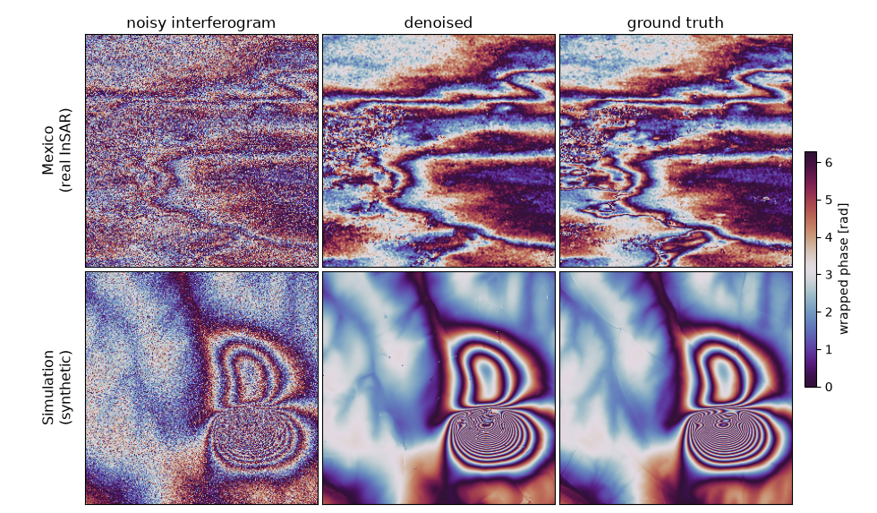

# InSARFlow: Riemannian Flow Matching for Interferometric SAR



`InSARFlow` implements generative models for Interferometric Synthetic Aperture Radar (InSAR)
phase data. It runs **flow matching on the flat torus**, which handles the
inherent 2π-periodicity of SAR phase natively instead of treating it as an unconstrained
real-valued signal. 

*Quickstart: → [`demo.ipynb`](demo.ipynb)*

---


## Loading a checkpoint

`InSARFlow.from_checkpoint` rebuilds the model from the config stored inside the `.ckpt`
(backbone, manifold, image size) and loads the weights — you don't need to know the
architecture up front. `denoise` then solves the flow-matching ODE on the flat torus,
starting from the noisy phase.

```python

from insarflow.data import MexicoDataset
from insarflow.model import InSARFlow
from insarflow.utils.logger import show

model, _ = InSARFlow.from_checkpoint("ckpt/mexico.ckpt", device=DEVICE)
model.eval()
denoised = model.denoise(noisy_interferogram, steps=N_STEPS, method="midpoint", use_ema=True)

# One row per sample: noisy interferogram | model output | ground truth
show(noisy_interferogram, denoised, clean, "Mexico", img_size=IMG_SIZE)
```

Swapping to `ckpt/simulation.ckpt` and `SimulationInSARDataset` runs the same code on the
synthetic domain — because the architecture comes from the checkpoint, nothing else changes.

See [`demo.ipynb`](demo.ipynb) for the full runnable version covering both datasets.
Note that `ckpt/` is git-ignored: the checkpoints come from the Drive folder above.


## Installation

### With uv (recommended)

Needs [uv](https://docs.astral.sh/uv/).

```bash
git clone git@github.com:lebellig/insarflow.git
cd insarflow
uv sync                 # creates the virtual environment
uv sync --extra dev     # with development extras
```

`uv sync` picks the right PyTorch build automatically: the `pytorch-cu128` index (CUDA 12.8)
on Linux/Windows, PyPI (CPU + MPS) on macOS. This is driven by the `sys_platform` markers on
`torch` / `torchvision` in `[tool.uv.sources]`; to force CPU-only on Linux or Windows, point
them at `https://download.pytorch.org/whl/cpu`.

### With conda

```bash
conda create -n insarflow python=3.11
conda activate insarflow

git clone git@github.com:lebellig/insarflow.git
cd insarflow

# On Linux/Windows with a GPU, install the matching PyTorch build first
pip install torch torchvision --index-url https://download.pytorch.org/whl/cu128

pip install -e .            # editable install
pip install -e ".[dev]"     # with development extras
```

The `[tool.uv.sources]` pins are uv-only, so `pip` resolves `torch` / `torchvision` from PyPI —
hence the explicit `--index-url` line above when you need a specific CUDA build. On macOS, or
for CPU-only, drop that line (or point it at `https://download.pytorch.org/whl/cpu`) and let
`pip install -e .` pull the default wheels.

Both entry points then run without the `uv run` prefix: `python -m insarflow.train`,
`insarflow-train`, and so on.

---

## Downloading the checkpoints

`ckpt/` is git-ignored, so the pretrained weights are not distributed with the repository. They
live in a [shared Google Drive folder](https://drive.google.com/drive/folders/14O9JmA2hXnp62npSp_I89TL9bHc3eNfS?usp=sharing)
instead. Both files are ~2 GB (~4 GB total).

Download `mexico.ckpt` and `simulation.ckpt` and place them in a `ckpt/` directory at the
repository root:

```
insarflow/
└── ckpt/
    ├── mexico.ckpt        # trained on real Mexico interferograms
    └── simulation.ckpt    # trained on synthetic data
```

These are the paths the code and the demo notebook expect.

---

### Saving and resuming

```python
model.save_checkpoint("checkpoint.ckpt", step=1000, optimizer=optimizer, scheduler=scheduler)

model, checkpoint = InSARFlow.from_checkpoint("checkpoint.ckpt", device="cuda")
step = model.load_training_state(checkpoint, optimizer, scheduler)
```

---

## Training and inference from the CLI

Both entry points are configured with [Hydra](https://hydra.cc/); configs live in `configs/`.
The `dataset` group selects the domain and carries all dataset-specific values — `img_size`,
`batch_size`, and the dataset targets — accessed as `cfg.dataset.*`. Note the two entry points
default differently: **`train.yaml` defaults to `mexico`, `inference.yaml` to `simulation`.**
Either can be overridden with `dataset=`.

```bash
# Training  (mexico by default)
uv run python -m insarflow.train
uv run python -m insarflow.train dataset=simulation

# Inference  (simulation by default)
uv run python -m insarflow.inference \
  name=my_experiment \
  checkpoint=/path/to/checkpoint.ckpt

uv run python -m insarflow.inference \
  dataset=mexico \
  name=my_experiment \
  checkpoint=/path/to/checkpoint.ckpt
```

The package also installs `insarflow-train` and `insarflow-inference` console scripts, which are
equivalent to the `python -m` invocations above.

Key training parameters (in `configs/train.yaml`):

| Parameter | Config key | Default |
|-----------|-----------|---------|
| Learning rate | `lr` | `1e-4` |
| EMA decay | `ema_decay` | `0.999` |
| Gradient clipping | `grad_clip` | `0.5` |
| LR warmup steps | `warmup_steps` | `500` |
| Total steps | `max_training_steps` | `100000` |
| ODE sampling steps | `sampling_steps` | `50` |

(`configs/inference.yaml` spells the same knob `n_sampling_steps`.)

Both dataset groups currently use `img_size: 256` and `batch_size: 4`; they differ only in the
dataset class they instantiate (`MexicoDataset` vs. `SimulationInSARDataset`) and the data roots.

---

### Backbones

Selected via the `backbone_name` config key. The [FCDM family](https://github.com/star-kwon/FCDM)
(`insarflow/models/fcdm.py`) is a
fully convolutional U-Net with ConvNeXt blocks and adaLN-Zero timestep conditioning — being
fully convolutional, it has no `img_size` dependency.

| `backbone_name` | Parameters | `hidden_size` | `depth` |
|----------------|-----------|--------------|---------|
| `FCDMSmall` | ~32M | 128 | `[2,4,8,4,2]` |
| `FCDMBase` — **default** | ~126M | 256 | `[2,4,8,4,2]` |
| `FCDMLarge` | ~501M | 512 | `[2,4,8,4,2]` |
| `FCDMXLarge` | ~695M | 512 | `[3,6,12,6,3]` |

(Counts measured at `in_channels=1, out_channels=1`.)

---

## Datasets

*Links to the datasets are coming soon*.

Both datasets take `split="train" | "val" | "test"` and carve out a fixed 100-sample validation
set so the split is identical across runs.

**`SimulationInSARDataset`** — synthetic InSAR. The last 10,000 files of the sorted list are the
test split; `val` is the first 100 of what remains, `train` the rest. These have been generated
using [Wu et al.'s interferogram simulator](https://github.com/Wu-Patrick/InterferogramSimulator).

```
root_dir/
├── interf/          # Noisy wrapped interferograms (*.tif)
└── originWrapped/   # Clean wrapped phase (*.tif)
```

**`MexicoDataset`** — real InSAR from Mexico using Sentinel-1 SLC at 10m GSD, acquired every 12 days
between August 14, 2019 and December 6, 2020. Here the test split is a separate directory rather
than a slice: `train` and `val` both read the `train/` subdirectories (`val` taking the first 100
files), while `test` reads the `test/` subdirectories. Files are shuffled with a fixed seed of 42.

```
root_dir/
├── raw/{train,test}/           # Noisy wrapped interferogram patches (*.tif)
├── clean/{train,test}/         # Clean wrapped interferogram patches (*.tif)
├── raw_image/{train,test}/     # Noisy SAR image patches — complex64 (*.npy)
├── clean_image/{train,test}/   # Clean SAR image patches — complex64 (*.npy)
└── metadata/{train,test}/      # Per-patch metadata (*.txt), contains time_diff
```

For `val` and `test`, `__getitem__` also returns the SAR images and the pseudo-clean ground truth
obtained with the temporal baseline from [COFI-PL](https://ieeexplore.ieee.org/document/10938382).

---

## Project structure

```
insarflow/
├── pyproject.toml                          # Package metadata and dependencies (UV/Hatchling)
├── .python-version                         # Python version pin (3.11)
├── README.md                               # This file
├── demo.ipynb                              # Denoising demo on both datasets
├── assets/denoising.png                    # README figure
│
├── configs/                                # Hydra configuration files
│   ├── train.yaml                          # Training config (defaults to Mexico dataset)
│   ├── inference.yaml                      # Inference config (defaults to Simulation dataset)
│   └── dataset/                            # Dataset config group
│       ├── mexico.yaml                     # Mexico dataset (real InSAR, 256×256, batch 4)
│       └── simulation.yaml                 # Simulation dataset (synthetic InSAR, 256×256, batch 4)
│
└── insarflow/                              # Main Python package
    ├── __init__.py                         # Public API: InSARFlow, EMAModel
    ├── model.py                            # Core model: InSARFlow + EMAModel + registries
    ├── train.py                            # Training entry point (Hydra + Lightning Fabric)
    ├── inference.py                        # Inference entry point (Hydra)
    ├── metrics.py                          # Circular MSE/MAE/RMSE, phase coherence, PSNR
    │
    ├── models/                             # Neural network backbones
    │   ├── __init__.py                     # Exports: FCDMSmall / Base / Large / XLarge
    │   └── fcdm.py                         # FCDM variants (Small / Base / Large / XLarge)
    │
    ├── flow_matching/                      # Riemannian flow matching framework
    │   ├── __init__.py
    │   │
    │   ├── path/                           # Probability paths
    │   │   ├── __init__.py                 # Exports: ProbPath, GeodesicProbPath, PathSample
    │   │   ├── path.py                     # Abstract ProbPath base class
    │   │   ├── path_sample.py              # PathSample dataclass
    │   │   ├── geodesic.py                 # GeodesicProbPath (Riemannian geodesic interpolation)
    │   │   └── scheduler/
    │   │       ├── __init__.py             # Exports: Scheduler, ConvexScheduler, CondOTScheduler, SchedulerOutput
    │   │       └── scheduler.py            # Scheduler, ConvexScheduler, CondOTScheduler
    │   │
    │   ├── solver/                         # ODE solvers
    │   │   ├── __init__.py                 # Exports: Solver, RiemannianODESolver
    │   │   ├── solver.py                   # Abstract Solver base class
    │   │   └── riemannian_ode_solver.py    # RiemannianODESolver (Euler / midpoint / RK4 on manifold)
    │   │
    │   └── utils/                          # Utility functions and manifolds
    │       ├── __init__.py                 # Exports: expand_tensor_like, ModelWrapper
    │       ├── utils.py                    # expand_tensor_like
    │       ├── model_wrapper.py            # ModelWrapper abstract class
    │       └── manifolds/
    │           ├── __init__.py             # Exports: Manifold, Euclidean, FlatTorus, geodesic
    │           ├── manifold.py             # Abstract Manifold + Euclidean
    │           ├── torus.py                # FlatTorus: [0, 2π]^D (main manifold for InSAR)
    │           └── utils.py                # geodesic() path generator
    │
    ├── data/                               # Dataset classes
    │   ├── __init__.py                     # Exports: SimulationInSARDataset, MexicoDataset
    │   ├── simulation.py                   # SimulationInSARDataset (synthetic InSAR)
    │   ├── mexico.py                       # MexicoDataset (real InSAR, TIFF format)
    │   └── build.py                        # Standalone script: slices full-image .npy into patches
    │
    ├── evaluation/                         # Baseline comparisons
    │   └── baselines/phinet/               # PhiNet baseline: test_demo.py, visualize_results.py
    │
    └── utils/                              # Project utilities
        ├── __init__.py                     # Exports: setup_logging, fabric_print
        └── logger.py                       # setup_logging(), fabric_print(), show()
```
